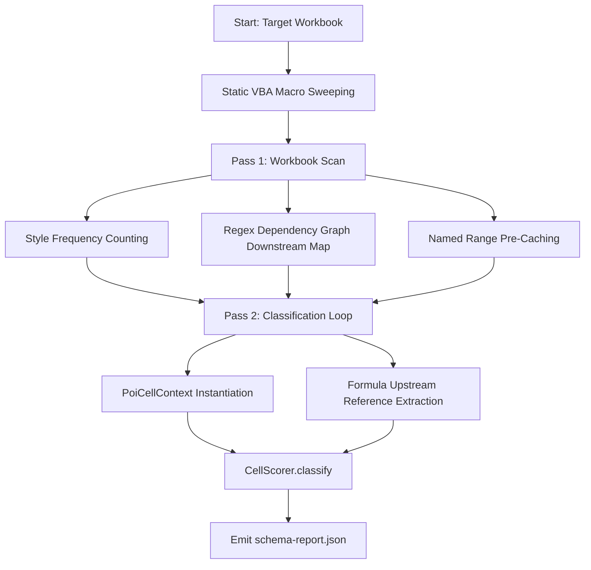

# ReverseXL Developer Guide

This document details the internal architecture, heuristic scoring engine, two-pass analysis algorithms, POI adapter design, and extension guidelines for **ReverseXL**.

---

## 📋 Table of Contents
1. [Architecture & Component Design](#-architecture--component-design)
2. [Heuristic Scoring Engine (`CellScorer`)](#-heuristic-scoring-engine-cellscorer)
   - [Scoring Matrix & Weights](#scoring-matrix--weights)
   - [Threshold & Confidence Mathematics](#threshold--confidence-mathematics)
3. [Two-Pass Workbook Analysis Pipeline](#-two-pass-workbook-analysis-pipeline)
   - [Pass 1: Style Clustering & Downstream Indexing](#pass-1-style-clustering--downstream-indexing)
   - [Pass 2: Context Binding & Classification](#pass-2-context-binding--classification)
4. [Cell Context Abstraction (`CellContext` & `PoiCellContext`)](#-cell-context-abstraction)
5. [Static VBA Macro Inspection (`VBAMacroReader`)](#-static-vba-macro-inspection)
6. [Hermetic TDD Framework (`StringTddRunner`)](#-hermetic-tdd-framework)
7. [Extending ReverseXL](#-extending-reversexl)
   - [Adding a New Heuristic Signal](#adding-a-new-heuristic-signal)
   - [Custom AST Formula Parsing](#custom-ast-formula-parsing)
8. [Build & Packaging Details (`maven-shade-plugin`)](#-build--packaging-details)

---

## 🏛️ Architecture & Component Design

ReverseXL follows a strict separation of concerns, decoupling workbook format parsing from heuristic decision logic:

```
org.reversexl
├── engine
│   ├── CellContext.java          # Abstract interface declaring cell properties and contextual cues
│   ├── SimpleCellContext.java    # Pure Java POJO & builder used for hermetic unit testing
│   ├── PoiCellContext.java       # Adapter bridging Apache POI Cell instances to CellContext
│   └── CellScorer.java           # Pure heuristic classification engine (Role, Confidence, Evidence)
├── parser
│   └── WorkbookParser.java       # Standalone high-level workbook structural analyzer
├── Main.java                     # CLI entry point, 2-pass analyzer, and Gson JSON report generator
└── [test]
    ├── StringTddRunner.java      # Zero-dependency assertion runner
    ├── CellScorerTest.java       # Heuristic unit test suite
    ├── PoiCellContextTest.java   # POI context adapter test suite
    └── WorkbookParserTest.java   # In-memory workbook integration suite
```

---

## 🧠 Heuristic Scoring Engine (`CellScorer`)

The [`CellScorer`](file:///home/bradn44/Projects/current/excelExtractor/src/main/java/org/reversexl/engine/CellScorer.java) class evaluates a [`CellContext`](file:///home/bradn44/Projects/current/excelExtractor/src/main/java/org/reversexl/engine/CellContext.java) snapshot and assigns positive/negative score vectors for candidate roles:

### Scoring Matrix & Weights

```
INPUT SCORE:
  +5  Unlocked cell inside a protected worksheet
  +4  Cell intersects a sheet DataValidation constraint region
  +4  Targeted by a VBA macro clearing routine (Range().ClearContents)
  +3  Constant cell referenced by ≥ 1 downstream formula
  +3  Cell style matches dominant input style cluster
  +2  Cell has an explicit Named Range
  +2  Cell has an adjacent label (1–2 cells left or 1 cell above)
  +1  Downstream formula dependents count > 3
  -5  Cell is a formula

OUTPUT SCORE:
  +5  Targeted by a VBA macro export/reporting routine
  +4  Formula with zero downstream dependents (Leaf node)
  +3  Cell style matches dominant output style cluster
  +3  Sheet name contains "Result", "Summary", or "Output" (case-insensitive)
  +2  Cell has an adjacent engineering unit string (1 cell right, length 1–6)
  +2  Referenced by a workbook chart series
  -3  Cell is hidden (row or column hidden)

INTERMEDIATE RULE:
  If cell.isFormula() == true AND upstreamDependencies > 0 AND downstreamDependents > 0:
    -> Role = INTERMEDIATE (Confidence = 90%)
```

### Threshold & Confidence Mathematics
1. **Activation Threshold**: A candidate role must achieve a score **`> 4`** to be considered.
2. **Role Selection**:
   - If `inputScore > 4` and `inputScore > outputScore` $\to$ **`USER_INPUT`**
   - If `outputScore > 4` and `outputScore > inputScore` $\to$ **`OUTPUT`**
   - If `cell.isFormula()` with both upstream and downstream links $\to$ **`INTERMEDIATE`**
   - Otherwise $\to$ **`UNKNOWN`**
3. **Confidence Calculation**:
   $$\text{Confidence} = \min(100, \text{Score} \times 10)$$

---

## 🔄 Two-Pass Workbook Analysis Pipeline

In [`Main.java`](file:///home/bradn44/Projects/current/excelExtractor/src/main/java/org/reversexl/Main.java), workbooks are processed in two passes to prevent $O(N^2)$ lookups:



### Pass 1: Style Clustering & Downstream Indexing
1. **Style Cluster Analysis**:
   - Tallies style index frequencies for constants vs formulas.
   - **Default Style Suppression**: Style index `0` (the standard Excel blank style) is explicitly ignored.
   - **Collision Suppression**: If `dominantInputStyle == dominantOutputStyle`, both are reset to `-1` to eliminate false positives in unstyled sheets.
2. **Formula Downstream Map**:
   - Applies regex `\b([A-Z]{1,3}[0-9]{1,7})\b` across every formula in the workbook.
   - Builds `Map<String, Integer> downstreamCounts` keyed by `SheetName!CELLREF`.
3. **Named Range Caching**:
   - Extracts all non-function names from `workbook.getAllNames()` into a fast lookup table.

### Pass 2: Context Binding & Classification
1. Pre-fetches sheet-level data validations via `sheet.getDataValidations()`.
2. Evaluates adjacent left/above labels and adjacent right unit tokens.
3. Computes formula upstream references and populates `dependsOn` lists.
4. Instantiates `PoiCellContext` and executes `CellScorer.classify(ctx)`.
5. Serializes classified nodes to `schema-report.json` via Gson.

---

## 🔌 Cell Context Abstraction

The [`CellContext`](file:///home/bradn44/Projects/current/excelExtractor/src/main/java/org/reversexl/engine/CellContext.java) interface provides a hermetic contract isolating business logic from Apache POI APIs:

```java
public interface CellContext {
    boolean isLocked();
    boolean isSheetProtected();
    boolean hasDataValidation();
    boolean isClearedByMacro(String macroName);
    boolean isFormula();
    int getDownstreamDependentsCount();
    boolean matchesInputStyleCluster();
    boolean hasNamedRange();
    String getNamedRange();
    boolean hasAdjacentLabel();
    String getAdjacentLabel();
    boolean isReferencedByMacro(String macroName);
    boolean matchesOutputStyleCluster();
    String getSheetName();
    boolean hasAdjacentUnit();
    boolean isReferencedByChart();
    boolean isHidden();
    int getUpstreamDependenciesCount();
}
```

The [`PoiCellContext`](file:///home/bradn44/Projects/current/excelExtractor/src/main/java/org/reversexl/engine/PoiCellContext.java) adapter implements this interface, safely handling null rows, empty cells, boundary checking, and sheet protection flags.

---

## 🛡️ Static VBA Macro Inspection (`VBAMacroReader`)

ReverseXL inspects VBA projects without executing any runtime scripts:
- Reads the embedded `vbaProject.bin` compound storage stream using `org.apache.poi.poifs.macros.VBAMacroReader`.
- Applies regex matching for explicit range clearing calls:
  ```java
  Pattern CLEAR_CONTENTS_PATTERN = Pattern.compile(
      "(?i)Range\\(\"([A-Z]{1,3}[0-9]{1,7})(:[A-Z]{1,3}[0-9]{1,7})?\"\\)\\.ClearContents"
  );
  ```
- Gracefully catches `Exception` if the workbook is a non-macro `.xlsx` file, proceeding with an empty cleared cell set without failing.

---

## 🧪 Hermetic TDD Framework (`StringTddRunner`)

To maintain a zero-dependency supply chain posture, ReverseXL uses an embedded assertion runner ([`StringTddRunner`](file:///home/bradn44/Projects/current/excelExtractor/src/test/java/org/reversexl/StringTddRunner.java)):

```java
StringTddRunner.assertEquals("Leaf formula classifies as OUTPUT", Role.OUTPUT, result.role);
StringTddRunner.assertEquals("Confidence is 70%", 70, result.confidencePercentage);
```

### Running Test Suites:
```bash
mvn clean test-compile
java -cp target/excel-schema-extractor-1.0.0-SNAPSHOT.jar:target/test-classes org.reversexl.CellScorerTest
java -cp target/excel-schema-extractor-1.0.0-SNAPSHOT.jar:target/test-classes org.reversexl.PoiCellContextTest
java -cp target/excel-schema-extractor-1.0.0-SNAPSHOT.jar:target/test-classes org.reversexl.WorkbookParserTest
```

---

## 🚀 Extending ReverseXL

### Adding a New Heuristic Signal
1. **Declare Signal in `CellContext`**:
   Add a boolean/integer query method to [`CellContext.java`](file:///home/bradn44/Projects/current/excelExtractor/src/main/java/org/reversexl/engine/CellContext.java).
2. **Implement in POI Adapter**:
   Update [`PoiCellContext.java`](file:///home/bradn44/Projects/current/excelExtractor/src/main/java/org/reversexl/engine/PoiCellContext.java) to resolve the signal from POI `Cell` or `Sheet` APIs.
3. **Add Test Fixtures**:
   Update [`SimpleCellContext.java`](file:///home/bradn44/Projects/current/excelExtractor/src/main/java/org/reversexl/engine/SimpleCellContext.java) and write unit tests in [`CellScorerTest.java`](file:///home/bradn44/Projects/current/excelExtractor/src/test/java/org/reversexl/CellScorerTest.java).
4. **Update Scoring Weights**:
   Incorporate score points in [`CellScorer.java`](file:///home/bradn44/Projects/current/excelExtractor/src/main/java/org/reversexl/engine/CellScorer.java) and add descriptive evidence messages.

---

## 📦 Build & Packaging Details

ReverseXL uses `maven-shade-plugin` with `ServicesResourceTransformer` in [`pom.xml`](file:///home/bradn44/Projects/current/excelExtractor/pom.xml):
```xml
<transformer implementation="org.apache.maven.plugins.shade.resource.ServicesResourceTransformer"/>
```
> **Critical POI SPI Requirement:** Without `ServicesResourceTransformer`, shaded uber JARs overwrite POI's `META-INF/services/org.apache.poi.ss.usermodel.WorkbookProvider` descriptor, causing `WorkbookFactory.create()` to fail on `.xlsx` files.
